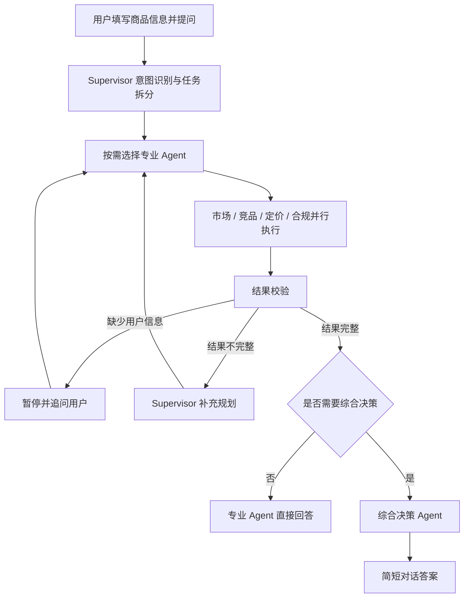
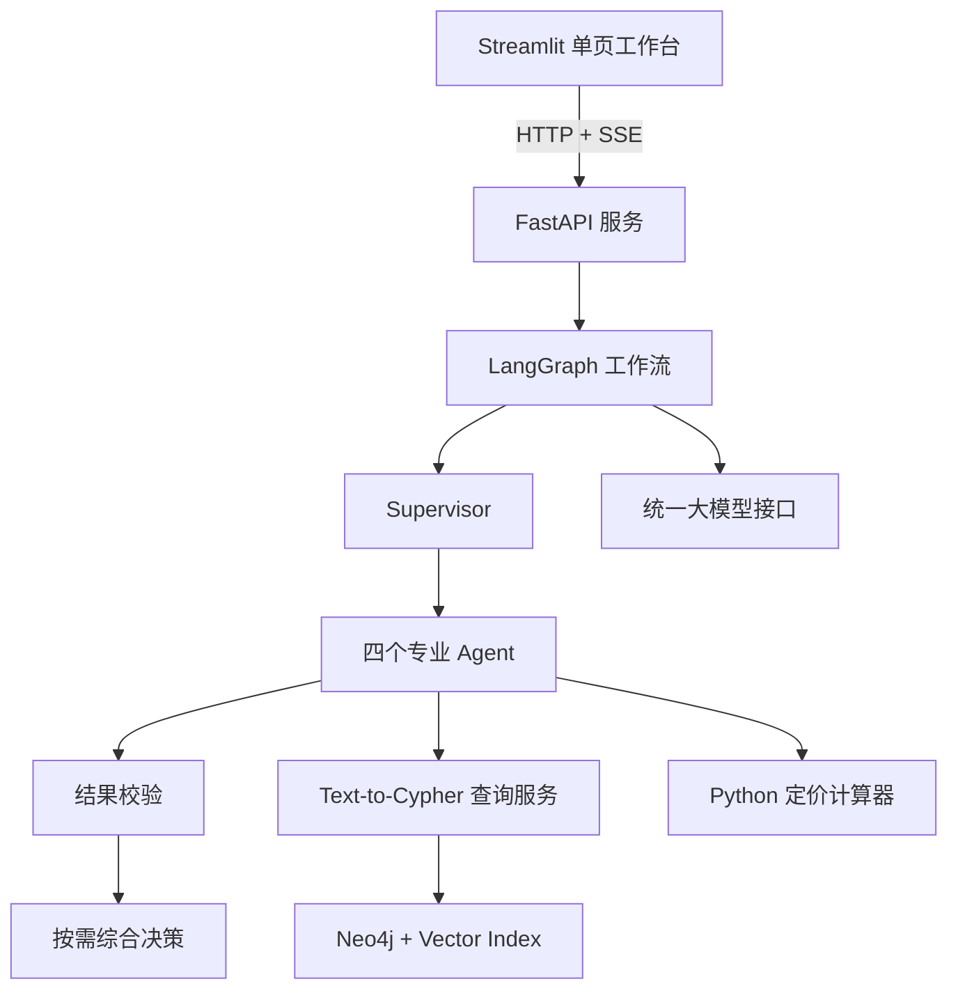
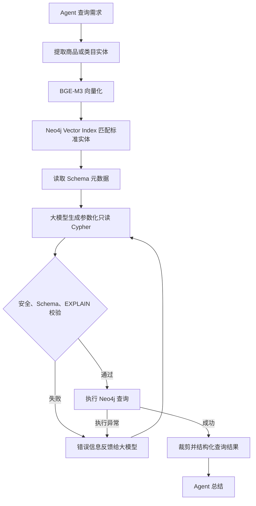

# CrossPilot 跨境电商智能决策 Multi-Agent 系统

## 项目需求文档

| 文档信息 | 内容 |
| --- | --- |
| 项目名称 | CrossPilot——跨境电商智能决策 Multi-Agent 系统 |
| 文档版本 | V1.0（简历级 MVP） |
| 目标市场 | 美国 Amazon |
| 商品范围 | 消费电子配件、儿童玩具、家居用品 |
| 目标用户 | 跨境电商运营、选品人员、采购人员及中小卖家负责人 |
| 核心技术 | Streamlit、FastAPI、LangGraph、Neo4j、BGE-M3、大模型 API |
| 数据模式 | 90～120 条离线仿真商品数据，不依赖实时 Amazon 接口 |

> 本文档只描述第一版 MVP。系统不接入真实 Amazon 账号，不执行上架、改价、广告投放或认证申请，也不使用 MCP、Function Calling、A2A、关系型数据库和外部向量数据库。

---

## 1. 项目概述

CrossPilot 是一个将多智能体协作与 Neo4j 知识图谱结合的跨境电商分析系统。用户填写候选商品的基础信息并提出自然语言问题后，系统识别用户真实意图，将任务拆分给市场分析、竞品分析、利润与定价、合规准备四个同级专业 Agent。被选中的 Agent 可以并行执行，结果经过完整性校验后，再直接回答专项问题或生成综合市场进入建议。

系统既支持“这个类目市场需求怎么样”这类单项问题，也支持“结合市场、竞品、利润和合规资料，判断这款商品是否值得进入美国 Amazon”这类组合问题。系统不会每次固定执行全部 Agent，而是根据用户需求动态选择必要模块，从而减少无关调用和等待时间。

### 1.1 项目定位

本项目定位为一个可运行、可演示、可评测的简历级 MVP，用于体现以下工程能力：

- 使用 LangGraph 构建 Supervisor 多智能体工作流；
- 通过动态路由和并行执行处理不同业务问题；
- 使用 Neo4j 组织商品、市场、竞品和合规知识；
- 使用 BGE-M3 与 Neo4j Vector Index 完成实体标准化；
- 由大模型生成 Cypher，并通过校验、重试和只读限制保证查询可靠性；
- 使用确定性程序完成利润计算，避免大模型心算；
- 通过结果校验、缺参追问和会话恢复提高任务完成率；
- 使用测试集、结构化日志和 Docker Compose 完成基本工程化交付。

### 1.2 核心业务问题

系统主要回答四类问题：

1. 该商品所在类目在美国 Amazon 的市场表现如何？
2. 与该商品相似的主要竞品有哪些，竞争程度如何？
3. 在给定成本条件下，商品能否达到目标利润，应如何定价？
4. 卖家在上架和运输前，需要向生产厂家索取哪些合规资料？

当用户同时询问多个方面，或明确要求判断是否进入市场时，系统进一步给出“建议进入、谨慎进入、暂不建议进入”三类综合结论。

---

## 2. 项目背景

### 2.1 业务现状

跨境电商公司在引入一款新商品前，通常需要运营、选品和采购人员分别进行市场调研、竞品筛选、成本核算及资料确认。商品价格、评分、评论量、销售排名、平台费用、产品属性、认证文件和运输要求分散在不同数据来源中，工作人员需要反复查询和整理后才能形成判断。

普通大模型可以快速生成文字分析，但如果缺少明确的数据依据，容易出现虚构价格、混淆商品类别、遗漏成本项目或给出过度确定的合规结论。传统固定流程又无法适应用户只查询某一个方面的需求，容易产生不必要的分析步骤。

因此，需要一套能够理解问题、动态选择专业能力、基于图谱数据查询、执行确定性计算并验证结果完整性的智能分析系统。

### 2.2 核心痛点

| 业务痛点 | 具体表现 | CrossPilot 的解决方式 |
| --- | --- | --- |
| 信息分散 | 商品、品牌、竞品、市场指标和合规知识缺少统一关联 | 使用 Neo4j 构建统一知识图谱 |
| 分析耗时 | 人工需要反复查询、整理和比较多个维度 | 专业 Agent 按需并行执行 |
| 问题差异大 | 用户可能只问市场、竞品、定价或合规中的部分内容 | Supervisor 动态识别意图并选择 Agent |
| 大模型容易编造数据 | 直接对话缺少可靠业务依据 | 先查询图谱或执行计算，再由大模型解释 |
| 利润计算容易出错 | 成本项目多，且部分费用随售价变化 | Python 定价计算器完成确定性计算 |
| 合规职责容易错位 | 认证通常由厂家办理，卖家主要负责资料核对 | 将合规能力定位为资料准备和风险提示 |
| 结论不完整 | 某个 Agent 查询成功不代表已经回答用户问题 | 独立结果校验节点检查覆盖度和缺失信息 |
| 依据不可追溯 | 用户只能看到结论，看不到商品和规则之间的关系 | 提供可展开的图谱依据和关键查询数据 |

---

## 3. 建设目标与预期效果

### 3.1 建设目标

- 建立统一的美国 Amazon 商品分析入口；
- 支持市场、竞品、定价和合规准备四类专项分析；
- 支持任意两项及以上分析能力的组合调用；
- 支持完整的市场进入决策；
- 让每项重要结论来源于 Neo4j 查询结果、用户输入或确定性计算；
- 对 Cypher 生成、查询执行和结果完整性建立自动恢复机制；
- 提供可重复运行的离线数据、测试集和容器化环境。

### 3.2 预期效果

| 目标 | MVP 验收标准 |
| --- | --- |
| 动态路由 | 单项问题只调用对应 Agent，组合问题只调用相关 Agent |
| 并行处理 | 同时选择两个及以上专业 Agent 时并行执行 |
| 图谱查询 | 市场、竞品、合规 Agent 均通过 Text-to-Cypher 查询 Neo4j |
| 查询可靠性 | 非法或执行失败的 Cypher 最多自动修复 3 次 |
| 定价准确性 | 利润、利润率、盈亏平衡价和目标售价均由 Python 计算 |
| 缺参处理 | 缺少必要信息时暂停流程并向用户追问，补充后继续 |
| 结果完整性 | 校验节点能发现未完成任务、空结果和关键字段缺失 |
| 可解释性 | 用户可展开查看本次查询涉及的节点、关系和关键数据 |
| 可评测性 | 提供 30 条测试问题及四项核心指标统计 |
| 可部署性 | Streamlit、FastAPI、Neo4j 可通过 Docker Compose 一键启动 |

上述目标用于验证系统能力，不预设虚假的真实业务降本数据。项目完成后应根据测试运行结果记录真实指标，再用于简历描述。

---

## 4. 项目范围

### 4.1 第一版包含

- 美国 Amazon 单一市场和平台；
- 消费电子配件、儿童玩具、家居用品三类商品；
- 90～120 条结构化仿真商品数据；
- 商品、品牌、类目、市场、竞品、费用、风险属性、认证和材料关系；
- Supervisor、四个专业 Agent、结果校验节点、综合决策 Agent；
- BGE-M3 实体向量化及 Neo4j Vector Index；
- Text-to-Cypher 生成、校验、执行、重试和总结；
- Streamlit 单页工作台及当前会话上下文；
- FastAPI 服务和 SSE 流式进度；
- 图谱依据展开查看；
- 30 条基础评测集、自动化测试、日志和 Docker Compose。

### 4.2 第一版不包含

- Amazon 官方 API、实时爬虫和真实销量数据；
- 多平台、多国家和多币种规则体系；
- 用户注册、登录、权限及历史会话持久化；
- 评论情感分析、销量预测、库存补货和广告优化；
- 自动创建 Listing、修改售价或执行平台操作；
- 厂家认证办理、法律意见或“绝对合规”结论；
- 固定权重市场评分模型；
- MCP、Function Calling、A2A、FAISS、Milvus、MySQL、PostgreSQL；
- 公网部署和生产级高可用架构。

---

## 5. 用户与使用场景

### 5.1 目标用户

- 负责新品调研的跨境电商运营人员；
- 负责筛选候选商品的选品人员；
- 负责成本、供应商和材料沟通的采购人员；
- 需要快速审阅分析结果的中小卖家负责人。

### 5.2 典型场景

| 场景 | 示例问题 | 应调用模块 |
| --- | --- | --- |
| 单项市场分析 | “无线充电器在美国 Amazon 的需求和价格带怎么样？” | 市场 Agent |
| 单项竞品分析 | “找出这款磁吸充电器最接近的5个竞品。” | 竞品 Agent |
| 单项定价分析 | “采购成本29元，售价29.99美元，利润率是多少？” | 定价 Agent |
| 单项合规准备 | “这款含锂电池的产品需要向厂家索取哪些资料？” | 合规 Agent |
| 组合分析 | “分析市场和竞品，并告诉我有没有差异化机会。” | 市场 + 竞品 Agent |
| 完整决策 | “结合市场、竞品、利润和合规资料，判断是否值得进入。” | 四个专业 Agent + 综合决策 Agent |
| 缺参追问 | “帮我算这款商品利润。”但未提供售价或物流费用 | 定价 Agent 暂停并追问 |
| 连续追问 | “把目标利润率改成30%，重新算建议售价。” | 使用当前会话状态继续计算 |

---

## 6. 整体业务流程



### 6.1 用户提交需求

用户在 Streamlit 左侧表单填写商品基础信息，并在对话框中输入本次问题。商品名称、商品类别、采购成本和问题为基础必填项；售价、重量、尺寸、物流费、材质、电池属性、目标利润率等为选填项。

### 6.2 意图识别与任务拆分

Supervisor 根据用户问题输出结构化 JSON，识别需要调用的专业 Agent，并为每个 Agent 生成清晰的子任务。Supervisor 不直接执行 Neo4j 查询，也不负责专业分析。

### 6.3 按需并行执行

市场、竞品、定价和合规四个 Agent 在业务上是同级关系。只选择一个 Agent 时执行专项分析；选择多个 Agent 时通过 LangGraph 并行分支执行。未被问题涉及的 Agent 不启动。

### 6.4 结果校验与补充

独立结果校验节点以“用户原问题 + 任务清单”为标准，检查对应 Agent 是否完成、查询结果是否为空、必要字段是否存在、结论是否有证据以及结果之间是否冲突。

- 缺少用户输入：暂停工作流并生成明确追问；
- 图谱结果不足或 Agent 输出不完整：返回 Supervisor 生成补充任务；
- 查询或生成异常：按对应重试策略恢复；
- 结果完整：进入回答或综合决策节点。

### 6.5 按需综合决策

只有用户同时询问两个以上方面，或明确询问是否进入市场时，才调用综合决策 Agent。它基于实际证据输出“建议进入、谨慎进入、暂不建议进入”之一，并说明关键依据，不使用固定权重评分。

### 6.6 输出结果

系统默认输出针对当前问题的简短对话答案，不强制生成长报告。页面同时展示简化的执行进度，并提供可展开的“图谱依据”；用户可以在同一会话中继续追问。

---

## 7. 整体系统架构



### 7.1 交互层

Streamlit 提供商品表单、自然语言对话、Agent 执行进度、补充信息输入、最终答案及图谱关系展示。页面采用单页工作台，不建设复杂后台管理系统。

### 7.2 API 服务层

FastAPI 负责输入校验、启动或恢复工作流、通过 SSE 返回进度事件、提供健康检查和图谱子图接口。API 不保存用户账号和历史记录。

### 7.3 多智能体编排层

LangGraph 维护一次分析任务的共享状态，完成意图识别、动态路由、并行执行、结果聚合、信息追问、补充规划和最终回答。当前会话由 thread_id 标识，状态仅用于本次运行和连续追问。

### 7.4 图谱查询层

市场、竞品和合规 Agent 通过同一套 Text-to-Cypher 服务访问 Neo4j。服务负责实体标准化、Schema 注入、Cypher 生成、安全校验、EXPLAIN 校验、执行、重试和结果裁剪。

### 7.5 确定性计算层

定价 Agent 使用 Python 计算器完成成本和利润测算。它可以读取用户输入和图谱中的平台费率，但不得要求大模型自行计算金额或利润率。

### 7.6 数据层

离线商品和知识数据统一存储在 Neo4j，不引入关系型数据库。用户临时输入和当前会话上下文保存在 LangGraph/Streamlit 会话状态中，不写入长期业务数据库。

---

## 8. Agent 功能需求

### 8.1 Supervisor Agent

**解决问题：** 用户问题类型不固定，固定执行全部模块会造成无效调用。

**主要功能：**

- 识别市场、竞品、定价、合规及综合决策意图；
- 将复合问题拆为多个相互独立的子任务；
- 选择一个或多个专业 Agent；
- 为每个 Agent 提供任务目标、商品上下文和期望输出字段；
- 接收校验节点的缺失项并生成补充任务；
- 限制同一任务最多进行 2 轮补充规划，避免无限循环。

**输出效果：** 形成结构化任务列表，确保只调用真正需要的专业 Agent。

### 8.2 Market Agent

**解决问题：** 运营人员难以快速判断类目需求、主流价格和市场竞争程度。

**主要功能：**

- 查询同类商品数量和有效样本量；
- 根据仿真评论量、评分、BSR 和需求指标判断需求热度；
- 计算平均价、中位价、最低价、最高价和主流价格区间；
- 根据商品数量和头部品牌占比判断竞争程度；
- 输出市场容量代理结论，并明确其不是实际销售额。

**输出效果：** 以高、中、低或强、中、弱等易理解方式说明市场需求和竞争情况，并附关键数值。

### 8.3 Competitor Agent

**解决问题：** 人工筛选相似商品和比较关键指标耗时，且容易只关注价格。

**主要功能：**

- 基于类目、功能、价格区间和实体相似度筛选候选商品；
- 返回与目标商品最相似的5个竞品；
- 比较品牌、价格、评分、评论量、BSR 和核心卖点；
- 总结目标商品与竞品之间的主要差异；
- 不在第一版中执行评论情感分析或用户痛点模型推理。

**输出效果：** 给出清晰的竞品对比和竞争位置判断，为差异化方向提供基础依据。

### 8.4 Pricing Agent

**解决问题：** 平台费、物流费、广告和退货损耗共同影响利润，大模型直接计算容易出错。

**主要功能：**

- 读取采购成本、汇率、头程物流、FBA 配送费、佣金率、广告费率、退货损耗率、售价和目标利润率；
- 用户未提供平台佣金、FBA费用或离线汇率时，可通过固定参数化 Cypher 从 Neo4j FeeRule 查询；用户输入始终优先；
- 缺少当前任务必需参数时生成追问；
- 计算单件总成本、单件利润、利润率和盈亏平衡价；
- 根据目标利润率反推建议售价；
- 可结合竞品主流价格带解释建议售价是否具有市场合理性。

**计算口径：**

```text
采购成本美元 = 采购成本人民币 ÷ 人民币兑美元汇率
固定成本 = 采购成本美元 + 头程物流费 + FBA配送费
变动费率 = Amazon佣金率 + 广告费率 + 退货损耗率
单件利润 = 售价 × (1 - 变动费率) - 固定成本
利润率 = 单件利润 ÷ 售价
盈亏平衡价 = 固定成本 ÷ (1 - 变动费率)
目标售价 = 固定成本 ÷ (1 - 变动费率 - 目标利润率)
```

**输出效果：** 返回可复算的数值结果，并明确输入假设，不让大模型直接心算。

### 8.5 Compliance Readiness Agent

**解决问题：** 认证通常由生产厂家办理，但跨境卖家仍需判断应该索取什么资料、已有资料是否覆盖当前型号，以及上架或运输前还缺什么。

**主要功能：**

- 根据商品类目、材质、适用年龄、电气属性、电池属性等识别风险特征；
- 查询相关认证、检测报告、标签、说明书和运输材料；
- 将“应具备资料”与用户提供的“已有资料”进行核对；
- 输出已具备、待确认、缺失和不适用四类状态；
- 提示应该向厂家索取或核实的资料；
- 说明潜在的平台审核、物流或上架风险；
- 明确结果仅用于资料准备和风险提示，不构成法律意见或合规认证。

**输出效果：** 形成与当前商品属性相关的资料核对结果，避免固定清单过于宽泛。

### 8.6 Result Validator Node

**解决问题：** 查询成功不代表结果已经覆盖用户真实需求。

**主要功能：**

- 对照用户问题和任务清单检查 Agent 覆盖情况；
- 检查关键字段、证据列表和查询结果是否为空；
- 检查多个 Agent 结论是否存在明显冲突；
- 区分“缺少用户输入”和“需要重新查询”；
- 生成通过、追问、补充规划或失败四类结果。

**输出效果：** 信息完整后才允许生成最终回答；不完整时只补充缺少的部分。

### 8.7 Strategy Agent

**解决问题：** 多个专业结果之间可能存在权衡，需要形成面向业务的结论。

**主要功能：**

- 仅在组合问题或市场进入决策问题中调用；
- 汇总实际执行的专业 Agent 结果；
- 识别有利条件、主要风险和前置条件；
- 输出“建议进入、谨慎进入、暂不建议进入”之一；
- 列出关键证据、风险和下一步行动；
- 不使用未经验证的固定权重和综合分数。

**输出效果：** 给出简洁、有依据、可执行的经营建议。

---

## 9. Neo4j 知识图谱需求

### 9.1 设计原则

三个商品类别共用一套基础图谱结构，再通过类别、特征和风险属性扩展差异。离线业务数据和合规知识统一存入 Neo4j，但当前用户会话数据不长期保存。

### 9.2 核心节点

| 节点 | 关键属性 | 用途 |
| --- | --- | --- |
| Product | product_id、name、title_en、price、rating、review_count、bsr | 商品主体和市场指标 |
| Category | category_id、name、category_group | 三类商品及子类目 |
| Brand | brand_id、name | 品牌和集中度分析 |
| Marketplace | marketplace_id、country、platform、currency | 固定为美国 Amazon |
| Feature | feature_id、name、value | 商品功能和卖点 |
| MarketMetric | metric_id、demand_level、period、sample_size | 离线市场代理指标 |
| FeeRule | fee_id、commission_rate、fba_fee、effective_date | 定价所需平台费率 |
| RiskAttribute | risk_id、name、risk_level | 电池、儿童使用、电气、材质等风险属性 |
| ComplianceRule | rule_id、name、scope、description | 上架、标签、运输和资料规则 |
| Document | document_id、name、issuer_type、validity_note | 认证、检测报告和材料 |

### 9.3 核心关系

```text
(Product)-[:BELONGS_TO]->(Category)
(Product)-[:MADE_BY]->(Brand)
(Product)-[:SOLD_ON]->(Marketplace)
(Product)-[:HAS_FEATURE]->(Feature)
(Product)-[:COMPETES_WITH]->(Product)
(Category)-[:HAS_MARKET_METRIC]->(MarketMetric)
(Category)-[:USES_FEE_RULE]->(FeeRule)
(Product)-[:HAS_RISK_ATTRIBUTE]->(RiskAttribute)
(RiskAttribute)-[:TRIGGERS]->(ComplianceRule)
(ComplianceRule)-[:REQUIRES_DOCUMENT]->(Document)
(ComplianceRule)-[:APPLIES_TO]->(Category)
```

### 9.4 数据规模

- 消费电子配件：30～40条商品；
- 儿童玩具：30～40条商品；
- 家居用品：30～40条商品；
- 总商品数：90～120条；
- 每条商品至少关联类目、品牌、平台和2～5个特征；
- 重点商品建立竞品关系；
- 三类商品均具备相应风险属性、规则和材料样例。

数据应明确标记为演示用仿真数据，数值分布保持合理，但不得声称来源于实时 Amazon 经营数据。

---

## 10. Text-to-Cypher 查询流程



### 10.1 实体标准化

系统从问题中提取商品名、类目名或品牌名，使用 BGE-M3 生成向量，通过 Neo4j Vector Index 返回最相近实体。若最高相似度低于阈值，系统不得强行绑定实体，应返回候选项或请求用户确认。

### 10.2 Schema 注入

系统在生成 Cypher 前提供允许访问的节点标签、关系类型、属性名和查询示例。大模型不得使用 Schema 中不存在的字段。

### 10.3 Cypher 生成约束

- 大模型通过统一 OpenAI 兼容 API 接入；
- 不使用 Function Calling，以约定 JSON 格式返回 `cypher`、`params` 和 `purpose`；
- 只允许单条参数化读查询；
- 默认返回上限为 50 条；
- 禁止在 Cypher 中拼接用户原始文本。

### 10.4 三层校验

1. **安全校验：** 禁止 CREATE、MERGE、DELETE、DETACH、SET、REMOVE、DROP、LOAD CSV、FOREACH 和写操作过程；
2. **Schema 校验：** 标签、关系和属性必须存在于允许列表；
3. **编译校验：** 使用 `EXPLAIN` 检查语法、参数和执行计划，不执行实际写入。

### 10.5 重试规则

- 校验失败或执行异常时，将错误类型、错误信息和当前 Schema 返回给大模型重新生成；
- 每次查询最多生成 3 次；
- 达到上限后停止并返回明确错误，不进入无限循环；
- 日志记录每次生成、失败原因、耗时和最终状态。

---

## 11. 前端功能需求

### 11.1 页面结构

Streamlit 使用单页分析工作台：

- 左侧：商品基础信息和可选成本/属性表单；
- 主区域上部：自然语言问题输入和发送按钮；
- 主区域中部：简化 Agent 执行进度；
- 主区域下部：对话答案、补充信息输入和图谱依据；
- 会话范围：只保留当前页面会话，刷新后允许清空。

### 11.2 执行进度

页面通过 SSE 展示以下阶段：

- 正在识别用户意图；
- 已选择的 Agent；
- 某 Agent 开始或完成；
- 正在查询知识图谱；
- Cypher 校验或重试；
- 正在校验结果；
- 正在生成最终答案；
- 工作流完成或失败。

技术日志默认不直接展示给业务用户。

### 11.3 图谱依据

最终答案下方提供可展开区域，只显示本次查询相关的节点和关系。至少展示节点名称、类型、关键属性和关系名称；关系数量超过上限时进行裁剪，避免页面拥挤。

### 11.4 连续追问

系统在当前会话保存最近商品信息、已完成结果、缺失字段和 thread_id，使用户能够继续询问“再看看竞品”或“把目标利润率改成30%重新计算”。

---

## 12. API 与流式事件需求

### 12.1 核心接口

| 方法 | 路径 | 用途 |
| --- | --- | --- |
| GET | `/health` | 检查 FastAPI、Neo4j 和模型配置状态 |
| POST | `/api/v1/analysis/stream` | 创建分析任务并以 SSE 返回执行进度 |
| POST | `/api/v1/analysis/{thread_id}/resume` | 补充信息后恢复暂停的工作流 |
| GET | `/api/v1/analysis/{thread_id}/graph` | 获取本次查询涉及的图谱子图 |

### 12.2 SSE 事件

事件类型至少包括：`workflow_started`、`intent_identified`、`agents_selected`、`agent_started`、`agent_completed`、`cypher_retry`、`input_required`、`validation_completed`、`answer_chunk`、`workflow_completed`、`workflow_failed`。

每个事件包含 `trace_id`、`thread_id`、`event_type`、`message`、`timestamp` 和可选 `payload`。

---

## 13. 异常处理

| 异常场景 | 系统行为 |
| --- | --- |
| 输入字段格式错误 | FastAPI 返回明确字段错误，不启动工作流 |
| 缺少业务必要信息 | 工作流暂停，通过 `input_required` 追问用户 |
| 实体匹配不确定 | 返回候选实体供用户确认，不强行查询 |
| Cypher 安全校验失败 | 拒绝执行并进入重新生成 |
| Cypher Schema/EXPLAIN 失败 | 携带错误信息重新生成，最多3次 |
| Neo4j 执行异常 | 记录异常并尝试修复，达到上限后返回失败 |
| 某专业 Agent 失败 | 其他 Agent 结果保留，校验节点决定重试或降级回答 |
| 结果不完整 | 返回 Supervisor 进行补充规划，最多2轮 |
| 大模型 API 超时 | 按指数退避重试，失败后给出可理解提示 |
| SSE 连接中断 | 前端提示重新连接或使用 thread_id 恢复 |

---

## 14. 评测需求

### 14.1 测试集组成

共准备30条测试问题：

- 市场分析：5条；
- 竞品分析：5条；
- 定价分析：5条；
- 合规准备：5条；
- 两个及以上 Agent 的组合问题：5条；
- 缺参、无关问题、实体歧义和异常场景：5条。

### 14.2 核心指标

| 指标 | 定义 |
| --- | --- |
| 意图识别准确率 | 正确识别用户所需分析类型的测试数 ÷ 总测试数 |
| Agent 路由准确率 | 实际调用 Agent 集合与标准集合一致的测试数 ÷ 总测试数 |
| Cypher 查询成功率 | 在3次生成限制内通过校验并成功执行的查询数 ÷ 查询总数 |
| 任务完成率 | 最终回答完整覆盖标准检查项的测试数 ÷ 总测试数 |

同时记录平均响应时间、平均大模型调用次数、Cypher 平均重试次数和失败类型。项目完成前不得预先虚构指标结果。

---

## 15. 非功能需求

### 15.1 安全性

- API Key、Neo4j 密码只通过 `.env` 注入，不写入代码；
- MVP 在应用层严格限制为只读 Cypher；生产部署时还应单独配置只读 Neo4j 账号形成第二层保护；
- 大模型生成的 Cypher 必须经过只读校验；
- 日志对 API Key、密码和用户敏感输入进行脱敏；
- 用户输入作为参数传递，不直接拼接到 Cypher。

### 15.2 可维护性

- 前端、API、工作流、Agent、图谱查询、定价计算和评测模块解耦；
- 统一使用 Pydantic 模型定义跨模块数据结构；
- 所有 Agent 共用模型适配器、查询服务和日志组件；
- 每个模块具备独立单元测试和明确输出契约。

### 15.3 可观测性

- 每个请求生成唯一 Trace ID；
- 使用 JSON 结构化日志；
- 记录意图、路由、Cypher、校验、重试、耗时和异常；
- 日志只保存在本地，不接入 LangSmith 等外部平台。

### 15.4 性能目标

- 不调用大模型时，健康检查和定价计算应在1秒内返回；
- 多 Agent 组合任务使用并行执行降低总等待时间；
- Neo4j 查询默认最多返回50条记录；
- 单次任务不得无限重试或无限补充规划。

---

## 16. 技术方案

| 层级 | 技术 | 作用 |
| --- | --- | --- |
| 前端 | Streamlit | 商品表单、对话、进度和图谱依据展示 |
| 后端 | FastAPI | 请求校验、SSE、工作流接口和健康检查 |
| 多智能体 | LangGraph | State、动态路由、并行分支、暂停恢复和校验回路 |
| 大模型 | OpenAI 兼容 API | 意图识别、任务拆分、Cypher 生成和结果总结 |
| 图数据库 | Neo4j | 统一保存业务数据、关系、合规知识和向量索引 |
| Embedding | BGE-M3 | 中英文商品实体和别名的语义匹配 |
| 计算 | Python + Decimal | 成本、利润、利润率、盈亏平衡价和目标售价 |
| 通信 | HTTP + SSE | Streamlit 调用 FastAPI 并实时接收进度 |
| 测试 | Pytest | 单元、集成和端到端测试 |
| 日志 | Python logging/structlog | 本地 JSON 结构化 Trace |
| 部署 | Docker Compose | 一键启动 Streamlit、FastAPI 和 Neo4j |

---

## 17. 最终验收标准

项目满足以下条件时视为 MVP 完成：

1. Docker Compose 能一次启动三个服务，健康检查通过；
2. Neo4j 中存在三类商品共90～120条，并建立索引、约束和业务关系；
3. BGE-M3 能将中英文或别名问题匹配到正确图谱实体；
4. 单项问题只调用对应专业 Agent；
5. 组合问题能并行调用多个专业 Agent；
6. 市场、竞品和合规 Agent 通过受控 Text-to-Cypher 查询图谱；
7. 非法 Cypher 不会执行，并能在3次内重试或明确失败；
8. 定价结果由 Python 计算并通过固定测试用例验证；
9. 必要信息缺失时，系统能暂停、追问并恢复原工作流；
10. 结果不完整时，校验节点能触发定向补充；
11. 单项问题直接回答，组合或进入决策问题按需调用 Strategy Agent；
12. Streamlit 能实时显示简化进度、最终答案和可展开图谱依据；
13. 30条评测问题可以自动运行并生成指标汇总；
14. 结构化日志包含 Trace ID、耗时、重试和错误信息；
15. README 能指导新的开发者完成配置、启动、数据初始化和演示。

---

## 18. 项目最终价值

CrossPilot 不是把多个提示词顺序串联起来的固定流水线，而是一个根据用户问题动态拆分任务、并行调用专业 Agent、基于知识图谱取证、使用确定性工具计算并通过校验回路保证完整性的智能分析系统。

它解决的核心问题是：让跨境电商人员能够围绕具体商品，以较低操作成本获取与当前问题直接相关的市场、竞品、利润和合规准备信息，同时保留关键结论的数据依据。对于简历和面试，该项目能够集中展示多智能体编排、Text-to-Cypher、知识图谱、结构化输出、错误恢复、流式交互和评测闭环等大模型应用工程能力。
