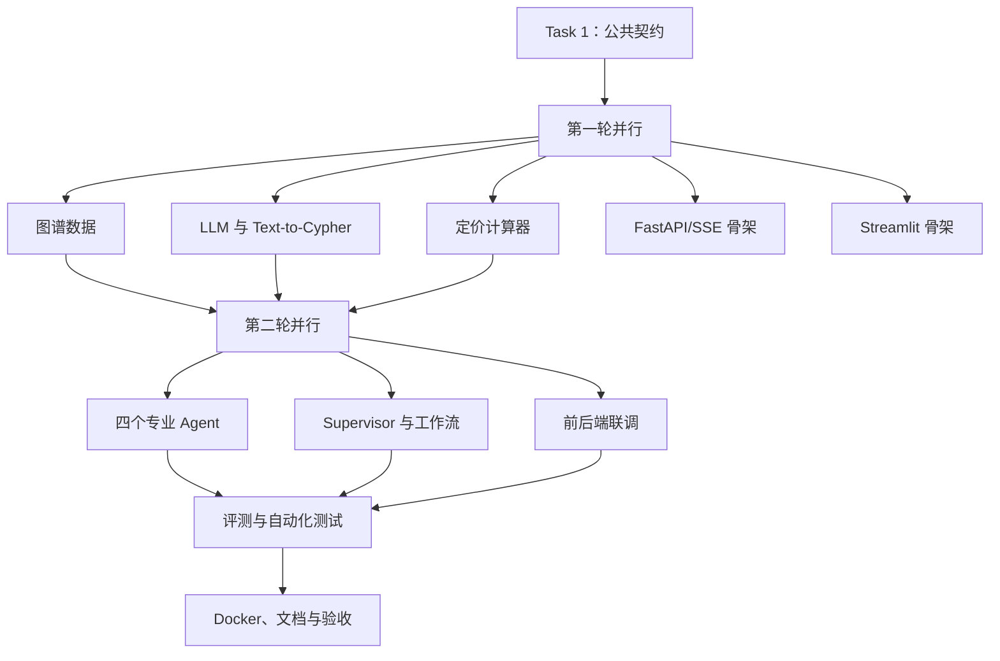

# CrossPilot Implementation Plan

> **For agentic workers:** REQUIRED SUB-SKILL: Use `superpowers:subagent-driven-development` (recommended) or `superpowers:executing-plans` to implement this plan task-by-task. Steps use checkbox (`- [ ]`) syntax for tracking.

**Goal:** 在两天内交付一个可运行、可演示、可评测的 CrossPilot MVP，支持美国 Amazon 商品的市场、竞品、定价和合规准备分析，并通过 Neo4j 与 LangGraph 展示多智能体工程能力。

**Architecture:** Streamlit 通过 FastAPI SSE 调用 LangGraph 工作流。Supervisor 根据用户问题选择四个同级专业 Agent 中的一个或多个并行执行；市场、竞品和合规 Agent 使用受控 Text-to-Cypher 查询 Neo4j，定价 Agent 使用 Python 确定性计算；结果校验节点决定通过、追问或补充规划，Strategy Agent 仅在组合决策时调用。

**Tech Stack:** Python 3.11+、Streamlit、FastAPI、LangGraph、Neo4j 5.x、BGE-M3、OpenAI 兼容模型 API、Pydantic、httpx、Pytest、Docker Compose。

**Spec:** `CrossPilot_项目需求文档.md`

## Global Constraints

- 第一版只支持美国 Amazon，以及消费电子配件、儿童玩具、家居用品三类商品。
- 所有离线业务和知识数据存入 Neo4j，不增加关系型数据库、FAISS 或 Milvus。
- 生成90～120条演示用仿真商品数据，并在界面和 README 中明确数据性质。
- 不使用 MCP、Function Calling 或 A2A；大模型使用普通 Chat Completions 风格接口和 JSON 结构化输出。
- 市场、竞品、合规 Agent 使用 Text-to-Cypher；定价 Agent 必须使用 Python `Decimal` 计算。
- Cypher 只允许参数化读查询，静态校验和 `EXPLAIN` 通过后才能执行，单次查询最多生成3次。
- Supervisor 最多进行2轮补充规划；任何工作流不得无限循环。
- 用户数据和对话仅保留在当前会话，不实现登录或持久化历史。
- 最终默认输出简短对话答案；图谱依据按需展开，不生成固定长报告或综合分数。
- 所有密钥和密码通过环境变量注入，不写入代码、测试数据或日志。

---

## 1. 开发组织原则

### 1.1 采用两轮并行，而不是一次性全并行

公共接口、State 和 Neo4j Schema 必须先锁定。第一轮并行完成基础设施，第二轮并行完成业务模块，最后由主 Agent 单独集成。没有通过公共契约测试前，不得开始大规模合并。

### 1.2 文件所有权

| 执行者 | 独占目录/文件 | 禁止修改 |
| --- | --- | --- |
| 主 Agent | `app/contracts/`、`app/workflow/state.py`、依赖配置、最终 Docker/README | 无 |
| 图谱数据 Agent | `data/`、`scripts/seed_graph.py` | `app/agents/`、`ui/` |
| 查询服务 Agent | `app/graph/`、`app/services/embedding.py` | `app/workflow/`、`ui/` |
| 定价基础 Agent | `app/services/pricing_calculator.py`、`app/services/fee_rule_repository.py` | `app/agents/`、`ui/` |
| Agent 工作流 Agent | `app/agents/`、`app/workflow/` | `app/api/`、`ui/` |
| API Agent | `app/api/`、`app/main.py` | `app/agents/`、`ui/` |
| 前端 Agent | `ui/` | `app/`、`data/` |
| 评测工程 Agent | `eval/`、分配给自己的测试文件 | 业务模块源文件、Docker 文件 |

发现公共契约需要调整时，子 Agent 只能向主 Agent提交变更建议，由主 Agent统一修改并通知其他执行者。

### 1.3 Git 策略

- 已存在 Git 仓库：为每个并行任务创建独立 worktree/分支；
- 不存在 Git 仓库：主 Agent先初始化仓库并完成 Task 1，再创建工作分支；
- 每个任务通过自身测试后提交一次语义清晰的 commit；
- 主 Agent按依赖顺序合并，不直接同时合并所有分支；
- 合并冲突由主 Agent解决，禁止子 Agent覆盖他人目录。

---

## 2. 目标目录结构

```text
crosspilot/
├── app/
│   ├── main.py
│   ├── api/
│   │   ├── dependencies.py
│   │   ├── routes_analysis.py
│   │   ├── routes_graph.py
│   │   └── sse.py
│   ├── agents/
│   │   ├── supervisor.py
│   │   ├── market.py
│   │   ├── competitor.py
│   │   ├── pricing.py
│   │   ├── compliance.py
│   │   ├── result_validator.py
│   │   └── strategy.py
│   ├── contracts/
│   │   ├── api.py
│   │   ├── agents.py
│   │   ├── graph.py
│   │   └── events.py
│   ├── core/
│   │   ├── config.py
│   │   ├── errors.py
│   │   └── logging.py
│   ├── graph/
│   │   ├── client.py
│   │   ├── schema_registry.py
│   │   ├── entity_resolver.py
│   │   ├── cypher_generator.py
│   │   ├── cypher_validator.py
│   │   └── query_service.py
│   ├── services/
│   │   ├── llm.py
│   │   ├── embedding.py
│   │   ├── fee_rule_repository.py
│   │   └── pricing_calculator.py
│   └── workflow/
│       ├── state.py
│       ├── builder.py
│       ├── routing.py
│       └── runtime.py
├── ui/
│   ├── app.py
│   ├── api_client.py
│   ├── components.py
│   └── graph_view.py
├── data/
│   ├── csv/
│   ├── schema.cypher
│   └── seed_manifest.json
├── scripts/
│   ├── generate_seed_data.py
│   ├── seed_graph.py
│   └── verify_graph.py
├── eval/
│   ├── dataset.jsonl
│   ├── metrics.py
│   └── runner.py
├── tests/
│   ├── unit/
│   ├── integration/
│   └── e2e/
├── .env.example
├── .gitignore
├── docker-compose.yml
├── Dockerfile.api
├── Dockerfile.ui
├── pyproject.toml
└── README.md
```

---

## 3. 公共数据契约

Task 1 必须先创建以下契约，后续子 Agent 只依赖这些类型：

```python
from decimal import Decimal
from enum import StrEnum
from typing import Any, Literal
from pydantic import BaseModel, Field

class AgentName(StrEnum):
    MARKET = "market"
    COMPETITOR = "competitor"
    PRICING = "pricing"
    COMPLIANCE = "compliance"

class ProductInput(BaseModel):
    name: str = Field(min_length=1, max_length=200)
    category: Literal["consumer_electronics", "children_toys", "home_goods"]
    purchase_cost_cny: Decimal = Field(gt=0)
    selling_price_usd: Decimal | None = Field(default=None, gt=0)
    fx_cny_per_usd: Decimal | None = Field(default=None, gt=0)
    inbound_shipping_usd: Decimal | None = Field(default=None, ge=0)
    fba_fee_usd: Decimal | None = Field(default=None, ge=0)
    commission_rate: Decimal | None = Field(default=None, ge=0, lt=1)
    ad_rate: Decimal | None = Field(default=None, ge=0, lt=1)
    return_loss_rate: Decimal | None = Field(default=None, ge=0, lt=1)
    target_margin: Decimal | None = Field(default=None, ge=0, lt=1)
    weight_kg: Decimal | None = Field(default=None, gt=0)
    dimensions_cm: tuple[Decimal, Decimal, Decimal] | None = None
    material: str | None = None
    has_battery: bool | None = None
    intended_age: str | None = None
    provided_documents: list[str] = Field(default_factory=list)

class AnalysisRequest(BaseModel):
    product: ProductInput
    question: str = Field(min_length=2, max_length=2000)
    thread_id: str | None = None

class AgentTask(BaseModel):
    task_id: str
    agent: AgentName
    objective: str
    required_fields: list[str] = Field(default_factory=list)

class EvidenceRecord(BaseModel):
    source_type: Literal["neo4j", "calculator", "user_input"]
    summary: str
    cypher: str | None = None
    params: dict[str, Any] = Field(default_factory=dict)
    rows: list[dict[str, Any]] = Field(default_factory=list)
    graph_node_ids: list[str] = Field(default_factory=list)
    graph_edge_ids: list[str] = Field(default_factory=list)

class AgentResult(BaseModel):
    agent: AgentName
    status: Literal["success", "need_input", "failed"]
    summary: str
    data: dict[str, Any] = Field(default_factory=dict)
    evidence: list[EvidenceRecord] = Field(default_factory=list)
    missing_fields: list[str] = Field(default_factory=list)
    errors: list[str] = Field(default_factory=list)

class ValidationDecision(BaseModel):
    action: Literal["pass", "need_input", "replan", "fail"]
    missing_fields: list[str] = Field(default_factory=list)
    gaps: list[str] = Field(default_factory=list)
    follow_up_question: str | None = None

class SSEEvent(BaseModel):
    trace_id: str
    thread_id: str
    event_type: Literal[
        "workflow_started", "intent_identified", "agents_selected",
        "agent_started", "agent_completed", "cypher_retry",
        "input_required", "validation_completed", "answer_chunk",
        "workflow_completed", "workflow_failed"
    ]
    message: str
    timestamp: str
    payload: dict[str, Any] = Field(default_factory=dict)
```

`WorkflowState` 必须包含：`trace_id`、`thread_id`、`request`、`tasks`、`agent_results`、`validation`、`replan_count`、`final_answer`、`graph_nodes`、`graph_edges`、`errors`。并行 Agent 返回的 `agent_results` 必须通过自定义 reducer 按 AgentName 合并，不能互相覆盖。

---

## 4. 并行执行总览



---

## Task 1：项目骨架与公共契约（主 Agent，必须最先完成）

**Files:**
- Create: `pyproject.toml`
- Create: `.env.example`
- Create: `.gitignore`
- Create: `app/contracts/api.py`
- Create: `app/contracts/agents.py`
- Create: `app/contracts/graph.py`
- Create: `app/contracts/events.py`
- Create: `app/workflow/state.py`
- Create: `app/core/config.py`
- Create: `app/core/errors.py`
- Test: `tests/unit/test_contracts.py`

**Interfaces:**
- Produces: 第3节定义的所有 Pydantic 模型，以及 `WorkflowState` 和 `merge_agent_results()`。
- Consumes: 无。

- [ ] 创建目标目录和空的 `__init__.py`，确保 `python -c "import app"` 成功。
- [ ] 在 `pyproject.toml` 声明运行依赖：fastapi、uvicorn、streamlit、langgraph、langchain-core、openai、neo4j、sentence-transformers、pydantic-settings、httpx、structlog、pyvis；开发依赖：pytest、pytest-asyncio、pytest-cov、ruff、mypy。
- [ ] 在 `.env.example` 声明 `LLM_BASE_URL`、`LLM_API_KEY`、`LLM_MODEL`、`NEO4J_URI`、`NEO4J_USER`、`NEO4J_PASSWORD`、`EMBEDDING_MODEL=BAAI/bge-m3`、`API_BASE_URL`。
- [ ] 按第3节实现公共契约；把可变默认值改为 `Field(default_factory=list/dict)`，避免实例间共享。
- [ ] 实现 `merge_agent_results(left, right)`：以 `AgentName.value` 为键合并字典，右侧只覆盖同名 Agent，不删除其他并行结果。
- [ ] 编写 Pydantic 边界测试：空商品名、负成本、非法类别、费率大于等于1必须校验失败。
- [ ] 编写 reducer 测试：market 与 competitor 的并行结果合并后必须同时存在。
- [ ] 运行 `pytest tests/unit/test_contracts.py -q`，预期全部通过。
- [ ] 运行 `ruff check app tests/unit/test_contracts.py`，修复全部问题后提交 `chore: initialize crosspilot contracts`。

**Acceptance:** 任何子 Agent 只读取契约文件即可明确自己的输入和输出；公共类型测试全部通过。

---

## Task 2：Neo4j Schema、仿真数据与初始化（图谱数据 Agent，可并行）

**Files:**
- Create: `data/schema.cypher`
- Create: `data/csv/*.csv`
- Create: `data/seed_manifest.json`
- Create: `scripts/generate_seed_data.py`
- Create: `scripts/seed_graph.py`
- Create: `scripts/verify_graph.py`
- Test: `tests/integration/test_graph_seed.py`

**Interfaces:**
- Produces: PRD 第9节规定的节点、关系、索引、约束和数据清单。
- Consumes: `app/core/config.py` 中的 Neo4j 配置。

- [ ] 使用固定随机种子 `20260904` 生成商品数据，保证每次执行结果一致。
- [ ] 创建 `categories.csv`、`brands.csv`、`products.csv`、`features.csv`、`product_features.csv`、`market_metrics.csv`、`fee_rules.csv`、`risk_attributes.csv`、`product_risks.csv`、`compliance_rules.csv`、`documents.csv`、`rule_documents.csv`、`rule_categories.csv`、`product_competitors.csv`。
- [ ] 每个商品类别生成30～40条商品，总数保持90～120；价格、评分、评论量和BSR在合理范围内分布，并设置 `is_synthetic=true`。
- [ ] 每条 Product 关联一个 Category、一个 Brand、一个 Marketplace 和2～5个 Feature；重点商品至少关联5个 Competitor。
- [ ] 为电子配件准备电池、电气和无线功能风险样例；为儿童玩具准备年龄、材料和小零件风险样例；为家居用品准备材质、承重或食品接触风险样例。
- [ ] 在 `schema.cypher` 创建各业务ID唯一约束、常用查询索引，以及维度为1024、相似度为 cosine 的 `product_name_embeddings` 向量索引。
- [ ] 实现 `seed_graph.py`：先执行 Schema，再通过参数化 `UNWIND` 分批写入节点和关系；重复运行不产生重复节点。
- [ ] 实现 `verify_graph.py`：检查商品总数、各类别数量、孤立 Product、缺失价格/评分/BSR、无文档规则和无目标节点关系。
- [ ] `seed_manifest.json` 记录每个CSV行数、节点期望数、关系期望数和 `synthetic_data=true`。
- [ ] 启动本地 Neo4j 后运行 `python scripts/seed_graph.py && python scripts/verify_graph.py`，预期退出码为0。
- [ ] 运行 `pytest tests/integration/test_graph_seed.py -q`，验证重复导入幂等并提交 `feat: add neo4j schema and synthetic dataset`。

**Acceptance:** Neo4j 中存在三类共90～120个商品，无孤立 Product，约束、普通索引和向量索引均可查询。

---

## Task 3：模型适配、实体匹配和 Text-to-Cypher（查询服务 Agent，可并行）

**Files:**
- Create: `app/services/llm.py`
- Create: `app/services/embedding.py`
- Create: `app/graph/client.py`
- Create: `app/graph/schema_registry.py`
- Create: `app/graph/entity_resolver.py`
- Create: `app/graph/cypher_generator.py`
- Create: `app/graph/cypher_validator.py`
- Create: `app/graph/query_service.py`
- Test: `tests/unit/test_cypher_validator.py`
- Test: `tests/unit/test_cypher_generator.py`
- Test: `tests/integration/test_query_service.py`

**Interfaces:**
- Consumes: `ProductInput`、`EvidenceRecord`、Neo4j 配置和模型配置。
- Produces: `LLMClient.generate_json(schema, messages)`、`EntityResolver.resolve(text, labels, top_k=5)`、`GraphQueryService.query(question, entity_hint, purpose)`。

- [ ] 实现单例式异步 Neo4j Driver 生命周期，提供 `execute_read(cypher, params)`、`explain(cypher, params)` 和连接健康检查。
- [ ] 实现统一 OpenAI 兼容客户端；所有结构化任务使用普通消息接口，请求 JSON 文本并通过 Pydantic 校验，不调用 tools/functions 字段。
- [ ] 对无效 JSON 最多重试2次，每次向模型反馈准确的解析或字段错误；仍失败时抛出 `StructuredOutputError`。
- [ ] 使用 `SentenceTransformer("BAAI/bge-m3")` 生成归一化1024维向量；实现商品名、英文标题、品牌和别名的离线嵌入写入。
- [ ] 实现 `EntityResolver.resolve()`：查询 Neo4j Vector Index，返回 entity_id、label、display_name、score；低于配置阈值时标记 `needs_confirmation=true`。
- [ ] `SchemaRegistry` 只暴露 PRD 中允许的标签、关系和属性；生成紧凑文本 Schema 和版本哈希。
- [ ] `CypherGenerator` 返回 `{cypher, params, purpose}`；提示词明确要求单条、参数化、只读查询和 `LIMIT <= 50`。
- [ ] `CypherValidator` 拒绝多语句，以及 CREATE、MERGE、DELETE、DETACH、SET、REMOVE、DROP、LOAD CSV、FOREACH、写过程和未授权 CALL；校验标签、关系和属性允许列表。
- [ ] 静态校验通过后调用 `EXPLAIN`；只有 `EXPLAIN` 成功才允许执行真实查询。
- [ ] `GraphQueryService.query()` 将实体结果、Schema、问题传给生成器；校验或执行失败时把错误反馈给模型；总尝试次数严格限制为3。
- [ ] 查询结果最多保留50行和单行允许字段；返回 `EvidenceRecord`，并收集本次子图节点ID、关系ID。
- [ ] 单元测试必须覆盖：合法 MATCH、写语句、多语句、未知标签、未知属性、危险 CALL、缺少 LIMIT、错误参数和三次失败上限。
- [ ] 集成测试使用真实 Neo4j 和 FakeLLM，验证“一次非法、第二次合法”的修复流程及 Evidence 输出。
- [ ] 运行 `pytest tests/unit/test_cypher_validator.py tests/unit/test_cypher_generator.py tests/integration/test_query_service.py -q` 并提交 `feat: add guarded text-to-cypher service`。

**Acceptance:** 非法 Cypher 永远不会执行；合法 Cypher 可在3次限制内完成查询，并返回结构化证据和子图引用。

---

## Task 4：确定性定价计算器（定价基础 Agent，可并行）

**Files:**
- Create: `app/services/pricing_calculator.py`
- Create: `app/services/fee_rule_repository.py`
- Test: `tests/unit/test_pricing_calculator.py`
- Test: `tests/integration/test_fee_repository.py`

**Interfaces:**
- Consumes: `ProductInput` 及 Neo4j 中匹配美国 Amazon 类目和商品条件的 FeeRule。
- Produces: `FeeRuleRepository.get_rule(category, weight_kg)` 和 `calculate_pricing(product, fee_rule) -> PricingResult`，其中包含 fixed_cost、variable_rate、profit、margin、break_even_price、target_price、assumptions。

- [ ] 定义 `PricingResult` Pydantic 模型，全部金额字段使用 Decimal 并保留两位小数，费率保留四位。
- [ ] `FeeRuleRepository` 使用固定参数化 Cypher 查询美国 Amazon 的佣金率、FBA费和离线汇率，不调用大模型生成 Cypher；用户明确输入的值优先于图谱规则。
- [ ] 实现采购成本人民币转美元、固定成本、变动费率、利润、利润率、盈亏平衡价和目标售价公式。
- [ ] 若 `1 - variable_rate <= 0` 或 `1 - variable_rate - target_margin <= 0`，返回领域错误而不是除零。
- [ ] 不得静默补默认值；缺失售价时仍可计算目标售价，但不能伪造当前利润；缺少公式必需字段时返回明确字段列表。
- [ ] 固定测试：采购70元、汇率7、头程2美元、FBA 4美元、售价25美元、三项费率合计0.30，断言固定成本16、利润1.50、利润率0.06、盈亏平衡价22.86；目标利润率0.20时目标售价32.00。
- [ ] 添加零物流费、极高费率、负输入被契约拒绝和四舍五入测试。
- [ ] 添加真实 Neo4j 集成测试，验证指定类别能读取唯一有效 FeeRule，查不到规则时返回明确缺失字段而不是静默补值。
- [ ] 运行 `pytest tests/unit/test_pricing_calculator.py tests/integration/test_fee_repository.py -q` 并提交 `feat: add deterministic pricing calculator`。

**Acceptance:** 所有金额都可由输入复算，固定测试精确通过，任何 LLM 都不参与数值计算。

---

## Task 5：FastAPI 与 SSE 骨架（API Agent，可并行）

**Files:**
- Create: `app/main.py`
- Create: `app/api/dependencies.py`
- Create: `app/api/routes_analysis.py`
- Create: `app/api/routes_graph.py`
- Create: `app/api/sse.py`
- Create: `app/workflow/runtime.py`
- Test: `tests/unit/test_sse.py`
- Test: `tests/integration/test_api.py`

**Interfaces:**
- Consumes: `AnalysisRequest`、`SSEEvent`，以及后续注入的 `WorkflowRuntime`。
- Produces: `/health`、`/api/v1/analysis/stream`、`/resume`、`/graph` 四类接口。

- [ ] 实现应用生命周期：启动时初始化依赖，关闭时释放 Neo4j 和 HTTP 客户端。
- [ ] 实现 `SSEEncoder.encode(event)`，输出合法 `event:` 与 `data:` 行并以双换行结束；data 为 UTF-8 JSON。
- [ ] `POST /api/v1/analysis/stream` 校验请求、生成 trace_id/thread_id，并将 runtime 的异步事件转为 SSE。
- [ ] `POST /api/v1/analysis/{thread_id}/resume` 接收字段字典，恢复同一工作流并继续返回 SSE。
- [ ] `GET /api/v1/analysis/{thread_id}/graph` 返回 `{nodes, edges}`；未知 thread_id 返回404。
- [ ] `/health` 分别报告 api、neo4j、llm_config 状态；不得输出 API Key 或数据库密码。
- [ ] 客户端断开时取消未完成的流式发送，但保留可恢复的内存状态。
- [ ] 测试 SSE 编码、事件顺序、422字段错误、404未知线程和健康检查脱敏。
- [ ] 使用 FakeRuntime 运行 `pytest tests/unit/test_sse.py tests/integration/test_api.py -q` 并提交 `feat: add streaming analysis api`。

**Acceptance:** 即使 LangGraph 尚未合并，FakeRuntime 也能通过 API 连续返回完整 SSE 事件序列。

---

## Task 6：Streamlit 单页工作台骨架（前端 Agent，可并行）

**Files:**
- Create: `ui/app.py`
- Create: `ui/api_client.py`
- Create: `ui/components.py`
- Create: `ui/graph_view.py`
- Test: `tests/unit/test_ui_api_client.py`

**Interfaces:**
- Consumes: 第3节 AnalysisRequest/SSEEvent 的 JSON 表示和 Task 5 API。
- Produces: 商品表单、对话区、进度区、补充输入区、答案区和可展开图谱依据。

- [ ] 左侧表单实现必填字段：商品名称、三选一商品类别、采购成本；实现全部选填字段并允许为空。
- [ ] 主区域使用 chat_input 接收问题；表单与问题共同组成 AnalysisRequest。
- [ ] `api_client.stream_analysis()` 使用 httpx 流式 POST，逐条解析 SSE；不得等待完整响应后再展示。
- [ ] 将技术事件映射为业务提示，例如 `agent_started: market` 显示“正在分析市场数据”。
- [ ] 在 `st.session_state` 保存 thread_id、trace_id、最近商品信息、消息列表、缺失字段和 graph_data。
- [ ] 收到 `input_required` 后显示只包含缺失字段的补充表单；提交到 resume 接口，不创建新任务。
- [ ] 使用可展开区域展示图谱依据；用 pyvis 生成相关节点和边，限制最多30个节点、50条边。
- [ ] API 错误、SSE 中断和模型失败显示可理解提示，不把 Python 堆栈暴露到页面。
- [ ] 对 SSE 解析器使用固定文本流测试跨块拆分、中文内容和多个事件。
- [ ] 运行 `pytest tests/unit/test_ui_api_client.py -q` 并提交 `feat: add streamlit analysis workspace`。

**Acceptance:** 前端可连接 Fake API，实时展示进度、答案、追问表单和模拟子图。

---

## Task 7：四个专业 Agent（Agent 工作流 Agent，第二轮）

**Files:**
- Create: `app/agents/market.py`
- Create: `app/agents/competitor.py`
- Create: `app/agents/pricing.py`
- Create: `app/agents/compliance.py`
- Test: `tests/unit/test_specialist_agents.py`

**Interfaces:**
- Consumes: `AgentTask`、`ProductInput`、`GraphQueryService`、`FeeRuleRepository`、`calculate_pricing()`。
- Produces: 每个专业 Agent 均返回唯一一个 `AgentResult`。

- [ ] Market Agent 查询样本数、需求代理指标、价格统计和品牌集中度；数据为空时返回 failed，不让模型补写数字。
- [ ] Market Agent 输出 demand_level、price_band、competition_level、sample_size 和 evidence；明确容量是代理判断。
- [ ] Competitor Agent 查询同类和相似特征商品，按相似度与数据完整度返回前5个；排除目标商品自身。
- [ ] Competitor Agent 输出商品ID、名称、品牌、价格、评分、评论量、BSR、卖点和差异摘要；不执行评论情感分析。
- [ ] Pricing Agent 首先合并用户输入与 FeeRule；用户输入优先。仍缺少公式所需字段时返回 need_input 和精确字段列表；完整时只调用 pricing_calculator。
- [ ] Pricing Agent 将计算结果转为业务摘要，Evidence source_type 必须是 calculator，并保留输入假设。
- [ ] Compliance Agent 根据类别和风险属性查询规则、材料；把用户已提供材料与要求材料规范化后比较。
- [ ] Compliance Agent 输出 `available`、`missing`、`needs_confirmation`、`not_applicable` 四组材料及风险提示；固定附加“非法律意见、不替代厂家认证”声明。
- [ ] 为每个 Agent 使用 FakeQueryService/FakeCalculator 编写成功、空结果、缺参和依赖异常测试。
- [ ] 运行 `pytest tests/unit/test_specialist_agents.py -q` 并提交 `feat: implement specialist agents`。

**Acceptance:** 四个 Agent 职责无重叠，均遵循统一 AgentResult 契约，任何结论都有 Evidence 或显式失败原因。

---

## Task 8：Supervisor、并行编排、结果校验和 Strategy（工作流 Agent，第二轮）

**Files:**
- Create: `app/agents/supervisor.py`
- Create: `app/agents/result_validator.py`
- Create: `app/agents/strategy.py`
- Create: `app/workflow/routing.py`
- Create: `app/workflow/builder.py`
- Modify: `app/workflow/runtime.py`
- Test: `tests/unit/test_supervisor.py`
- Test: `tests/integration/test_workflow.py`

**Interfaces:**
- Consumes: 第3节契约和 Task 7 专业 Agent。
- Produces: `build_workflow(dependencies)` 编译后的 LangGraph，以及 `WorkflowRuntime.stream()`/`resume()`。

- [ ] Supervisor 使用 JSON 结构化输出生成 AgentTask 列表；允许 AgentName 只能来自四项枚举。
- [ ] 增加确定性路由兜底：出现“利润、毛利、售价、成本”必须包含 pricing；出现“认证、检测、材料、合规”必须包含 compliance；不得删除模型正确选择的其他 Agent。
- [ ] 使用 LangGraph `Send` 或等价并行分支把任务派发到专业 Agent；并行结果通过 `merge_agent_results` 聚合。
- [ ] 记录每个 Agent 的 started/completed 事件，并通过时间戳测试多个 Agent 在首个完成前均已启动。
- [ ] Result Validator 先做确定性覆盖检查，再用模型判断语义完整性；模型不得把缺少数据误判为成功。
- [ ] action=need_input 时使用 LangGraph `interrupt()` 暂停，并在 `Command(resume=...)` 后合并用户补充字段。
- [ ] action=replan 时回到 Supervisor，只为 gaps 生成补充任务；`replan_count >= 2` 后转 fail。
- [ ] 单项问题通过后直接由对应结果生成答案；两个及以上 Agent 或明确市场进入问题进入 Strategy。
- [ ] Strategy 只能输出 enter/cautious/do_not_enter 三类决策及理由；不得生成综合分数或虚构未出现的数据。
- [ ] 使用 InMemorySaver 保存当前进程会话状态，不增加 Redis 或数据库持久化。
- [ ] 单元测试覆盖市场单路由、市场+竞品双路由、四 Agent 路由、无关问题和结构化输出错误。
- [ ] 集成测试覆盖并行执行、缺参 interrupt/resume、结果补充、两轮上限和 Strategy 按需调用。
- [ ] 运行 `pytest tests/unit/test_supervisor.py tests/integration/test_workflow.py -q` 并提交 `feat: orchestrate crosspilot workflow`。

**Acceptance:** 工作流能够动态选择1～4个 Agent、真正并行执行、暂停恢复、补充规划并按需生成综合决策。

---

## Task 9：真实前后端联调和图谱依据（主 Agent 主持，第二轮）

**Files:**
- Modify: `app/api/dependencies.py`
- Modify: `app/workflow/runtime.py`
- Modify: `app/api/routes_graph.py`
- Modify: `ui/api_client.py`
- Modify: `ui/app.py`
- Modify: `ui/graph_view.py`
- Test: `tests/e2e/test_streaming_flow.py`

**Interfaces:**
- Consumes: Task 3、7、8 的真实服务与 Task 5、6 的 API/UI 骨架。
- Produces: 端到端可操作界面。

- [ ] 在 FastAPI 依赖容器中装配 LLMClient、Neo4jClient、EntityResolver、GraphQueryService、PricingCalculator 和编译后的工作流。
- [ ] `WorkflowRuntime.stream()` 将 LangGraph 节点事件映射为固定 SSEEvent，不把内部对象直接序列化给前端。
- [ ] 将 Evidence 的节点、关系汇总到当前 thread_id 的内存 TraceStore，供 graph 接口读取。
- [ ] 使用前端真实 API 客户端运行单市场问题，确认状态顺序为 started → intent → selected → agent → validation → answer → completed。
- [ ] 运行组合问题，确认 Streamlit 显示多个 Agent 并行状态且最后出现 Strategy 决策。
- [ ] 运行缺参定价问题，确认 input_required 后补充数据可从原 thread_id 恢复。
- [ ] 展开图谱依据，确认仅显示本次查询的相关节点与关系，且不超过前端限制。
- [ ] 编写 e2e 测试，用 FakeLLM + 测试 Neo4j 验证完整 SSE 事件和最终答案。
- [ ] 运行 `pytest tests/e2e/test_streaming_flow.py -q` 并提交 `feat: integrate streaming ui workflow`。

**Acceptance:** 用户可以在单页中提交问题、看到实时进度、补充缺失信息、获得答案并展开图谱依据。

---

## Task 10：结构化日志、评测集和指标（评测工程 Agent，第二轮）

**Files:**
- Create: `app/core/logging.py`
- Create: `eval/dataset.jsonl`
- Create: `eval/metrics.py`
- Create: `eval/runner.py`
- Create: `tests/unit/test_metrics.py`

**Interfaces:**
- Consumes: AnalysisRequest、工作流实际事件和最终状态。
- Produces: `eval/results.json`、`eval/report.md` 和本地 JSONL Trace 日志。

- [ ] 配置 structlog 输出 JSON；所有记录包含 trace_id、thread_id、component、event、duration_ms 和 status。
- [ ] 添加递归脱敏函数，键名包含 key、token、password、secret 时记录为 `***`。
- [ ] 创建30条 JSONL 评测数据：四类单项各5条、组合5条、缺参/无关/歧义/异常5条。
- [ ] 每条数据包含 id、request、expected_agents、expected_action、required_answer_fields；定价题额外包含 expected_numeric。
- [ ] `metrics.py` 实现意图识别准确率、Agent 路由集合完全匹配率、3次内 Cypher 成功率、任务完成率、平均延迟、平均模型调用和平均 Cypher 重试。
- [ ] `runner.py` 支持 `--mode mock` 和 `--mode live`；mock 用于CI，live 使用真实模型并单独记录结果，不把预期答案注入模型提示词。
- [ ] 评测报告同时输出成功率和失败样本ID，不允许只报平均值而隐藏失败。
- [ ] 添加指标计算测试：构造4条固定记录，手工断言每项指标。
- [ ] 运行 `pytest tests/unit/test_metrics.py -q`，再运行 `python -m eval.runner --mode mock` 并提交 `test: add evaluation dataset and tracing`。

**Acceptance:** 30条任务可重复运行，报告能量化四项核心指标并定位失败案例；日志中没有密钥和密码。

---

## Task 11：Docker Compose、README 与最终验收（主 Agent）

**Files:**
- Create: `Dockerfile.api`
- Create: `Dockerfile.ui`
- Create: `docker-compose.yml`
- Create: `README.md`
- Create: `tests/e2e/test_demo_cases.py`
- Modify: `.env.example`

**Interfaces:**
- Consumes: 全部已合并模块。
- Produces: 一键启动项目和最终交付说明。

- [ ] `Dockerfile.api` 安装 CPU 版依赖，暴露8000端口，启动 `uvicorn app.main:app --host 0.0.0.0 --port 8000`。
- [ ] `Dockerfile.ui` 暴露8501端口，启动 `streamlit run ui/app.py --server.address=0.0.0.0`。
- [ ] `docker-compose.yml` 定义 neo4j、api、ui 三个服务、健康检查、依赖关系、持久卷和环境变量；不把真实密钥写入文件。
- [ ] Neo4j 使用5.x Community镜像；MVP 由应用层只读校验保护 Cypher。README 说明生产环境还应使用只读数据库账号和更严格权限。
- [ ] 容器首次启动时显式执行 seed 命令或提供一条确定的初始化命令，不依赖人工进入 Neo4j Browser 复制语句。
- [ ] README 依次说明：项目背景、架构、功能边界、环境要求、配置、启动、导入数据、运行测试、运行评测、演示问题、停止服务和常见错误。
- [ ] 在 README 醒目标记“商品与市场数据为仿真离线数据；合规结果仅用于资料准备和风险提示”。
- [ ] 编写8个演示验收用例：四个单项、市场+竞品组合、完整决策、缺参恢复、非法Cypher重试。
- [ ] 执行 `docker compose config`，预期配置有效且无未解析变量。
- [ ] 执行 `docker compose up -d --build`，等待三个服务健康；运行 `python scripts/verify_graph.py`。
- [ ] 执行 `pytest -q --cov=app --cov-report=term-missing`；任何失败必须修复后重跑，不得跳过失败测试来完成验收。
- [ ] 执行 `python -m eval.runner --mode mock`，确认30条均能完成基线流程；真实模型评测结果按实际情况保留，不修改为预期值。
- [ ] 手工完成8个演示用例，检查前端状态、回答、追问和图谱依据。
- [ ] 执行 `docker compose down`，再从空环境重新启动一次，验证 README 步骤完整。
- [ ] 提交 `docs: finalize docker deployment and handoff`。

**Acceptance:** 新开发者仅根据 README 和 `.env.example` 即可完成启动、初始化、演示、测试和停止；全部自动化测试通过。

---

## 5. 两天执行排期

| 时间 | 主 Agent | 并行子 Agent |
| --- | --- | --- |
| 第1天 09:00–10:30 | 完成 Task 1，锁定接口并创建分支 | 等待公共契约 |
| 第1天 10:30–14:00 | 审查接口和处理阻塞 | Task 2、3、4、5、6 第一轮并行 |
| 第1天 14:00–15:30 | 逐个合并第一轮、运行契约和单元测试 | 修复各自模块问题 |
| 第1天 15:30–20:00 | 协调第二轮接口 | Task 7、8、9、10 并行推进 |
| 第2天 09:00–11:00 | 依赖顺序合并第二轮 | 子 Agent根据审查结果修复 |
| 第2天 11:00–14:00 | 端到端联调和关键缺陷修复 | 查询/API/UI Agent定向协助 |
| 第2天 14:00–17:00 | 完成 Task 11、Docker和全量测试 | 评测 Agent运行30条测试 |
| 第2天 17:00–20:00 | 8个演示用例、README复核和最终验收 | 只处理明确失败项 |

这是一份紧凑的两天 MVP 计划。若真实模型 API、BGE-M3 下载或 Docker 环境受阻，优先保证 FakeLLM 测试、Neo4j 查询、定价计算和完整业务链路可运行，再恢复外部依赖；不得用硬编码最终答案伪装成功。

---

## 6. 合并顺序

1. Task 1 公共契约；
2. Task 2 Neo4j Schema 和数据；
3. Task 3 查询服务；
4. Task 4 定价计算器；
5. Task 7 专业 Agent；
6. Task 8 LangGraph 工作流；
7. Task 5 FastAPI/SSE；
8. Task 6 Streamlit；
9. Task 9 联调；
10. Task 10 日志与评测；
11. Task 11 Docker、文档和验收。

每次合并后运行受影响模块测试；完成第8步后运行全部 unit/integration tests，完成第9步后增加 e2e tests，最终再执行全量测试和 Docker 冷启动。

---

## 7. 主 Agent 审查清单

### 7.1 需求一致性

- [ ] Market 与 Competitor 是两个独立、同级 Agent；
- [ ] 四个专业 Agent 按用户问题动态选择；
- [ ] 同时选择多个 Agent 时实际并行；
- [ ] Strategy 只在组合或市场进入问题调用；
- [ ] 默认输出简短对话答案；
- [ ] 合规输出没有“保证合规”或代办认证表述；
- [ ] 不包含评论情感、固定评分、实时 Amazon 或账户系统。

### 7.2 Text-to-Cypher 安全性

- [ ] 未校验的 Cypher 无法进入 execute 方法；
- [ ] 写关键词、多语句、未知 Schema 和危险 CALL 均被拒绝；
- [ ] 用户值通过 params 传递；
- [ ] `EXPLAIN` 在真实查询前执行；
- [ ] 重试严格限制为3次；
- [ ] 查询结果和图谱子图均设置数量上限。

### 7.3 工作流可靠性

- [ ] 并行 reducer 不覆盖其他 Agent 结果；
- [ ] 缺参能暂停并从同一 thread_id 恢复；
- [ ] replan 只补缺失任务且最多2轮；
- [ ] 单 Agent 失败不会删除其他成功结果；
- [ ] SSE 结束事件始终为 completed 或 failed；
- [ ] 当前会话状态不会被不同 thread_id 混用。

### 7.4 交付质量

- [ ] 全量 Pytest 通过；
- [ ] Docker 冷启动成功；
- [ ] 图谱验证脚本退出码为0；
- [ ] 30条评测集可运行；
- [ ] README 命令经过实际验证；
- [ ] `.env`、API Key、密码和日志未进入 Git；
- [ ] 页面明确标识仿真数据和合规免责声明。

---

## 8. 完成定义

只有同时满足以下条件，主 Agent 才能宣布项目完成：

1. 需求文档第17节的15项验收标准均有对应测试或人工验收记录；
2. `pytest -q` 无失败；
3. `docker compose up -d --build` 后三个服务健康；
4. 图谱数据规模、索引和关系通过验证脚本；
5. 8个演示用例全部产生符合预期的事件和回答；
6. 评测报告由真实运行生成，未虚构任何效果数字；
7. README 能在空环境复现项目；
8. 主 Agent 检查最终 diff，确认没有未实现占位、硬编码答案、密钥或越界功能。

执行本计划时，优先选择 `superpowers:subagent-driven-development`：主 Agent 按任务派发子 Agent，并在每次合并前分别进行需求符合性审查和代码质量审查。
